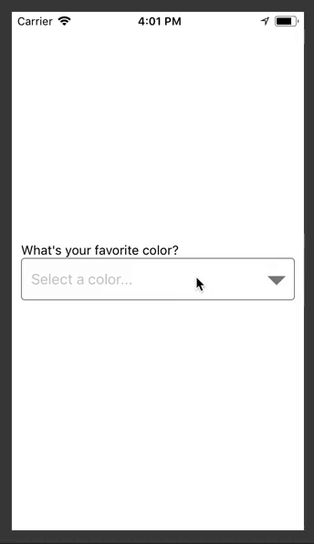

# React Native Picker Select

A Picker component for React Native which emulates the native `<select>` interfaces for iOS and Android

For iOS, we are wrapping a TextInput component. You can pass down your custom styling to match your other inputs.

For Android, we are using the native Picker component, but adding a pseudo-underline to emulate a typical TextInput. Additional styling can be passed down also to further customize the appearance.

For either platform, you can alternatively pass down a child element that will be wrapped in a touchable area, triggering the picker.

 


## Getting Started

### Installing

`npm install react-native-picker-select`

### Versioning

| Component | RN         |
| --------- |------------|
| >= 3.0.0  | >= 0.55.3  |
| < 3.0.0   | < 0.55.3   |

### Usage

**Required Props**
* `onValueChange` - function
  * Callback which returns `value, index`
* `items` - array
  * The items for the component to render. Each item should be in the following format:
  ```js
  {
    label: 'Orange',
    value: 'orange',
    key: 'orange',
  }
  ```
  * The label and the value are required, but the key will be based upon the label if it isn't included
  * The value can be any data type

**Optional Props**
* `placeholder` - object
  * An override for the default placeholder object with a label of `Select an item...` and a value of `null`
  * An empty object can be used if you'd like to disable the placeholder entirely
* `disabled` - boolean
  * Disables interaction with the component
* `value` - any
  * Will attempt to locate a matching value from the `items` array by checking each item's `value` property. If found, it will update the component to show that item as selected. If the value is not found, it will default to the first item.
* `style` - object
  * Style overrides for most parts of the component. More details below.
* `hideDoneBar` - boolean - *iOS ONLY*
  * For the iOS component, hides the bar with tabbing arrows and Done link to exit the modal. While this is typical on `<select>` elements on the web, the [interface guidelines](https://developer.apple.com/ios/human-interface-guidelines/controls/pickers/) does not include it.
* `hideIcon` - boolean - *iOS ONLY*
  * For the iOS component, hides the floating downward arrow on the right side of the input box
* `onUpArrow` and/or `onDownArrow` - function - *iOS ONLY*
  * Presence enables the corresponding arrow for iOS
  * Closes the picker
  * Calls the callback provided

### Styling

* iOS
  * The component wraps a TextInput without styling. In the style prop, pass a style object named `inputIOS` to style the input
  * Alternatively, you can pass children (such as a custom button or input) for the component to wrap
  * Other styles that can be modified for iOS are named `viewContainer`, `icon`, `done`, `modalViewTop`, `modalViewMiddle`, `modalViewBottom`, and `placeholderColor`
* Android
  * The default Picker component acts similiarly to a TextInput until it is tapped, although it does not include an underline
  * We emulate a typical underline, which can be modified with a style object named `underline`
  * The main input can be modified with the style object named `inputAndroid`
  * Alternatively, you can pass children (such as a custom button or input) for the component to wrap
  * Other styles that can be modified for Android are named `viewContainer` and `placeholderColor`

[See Examples](https://github.com/lawnstarter/react-native-picker-select/tree/master/example)

## Testing

This component has been tested on React Native v0.51 - v0.55

## Future Plans

- [ ] Update Android picker to look closer to platform's `<select>`

## License

react-native-picker-select is [MIT licensed](https://github.com/lawnstarter/react-native-picker-select/tree/master/LICENSE).